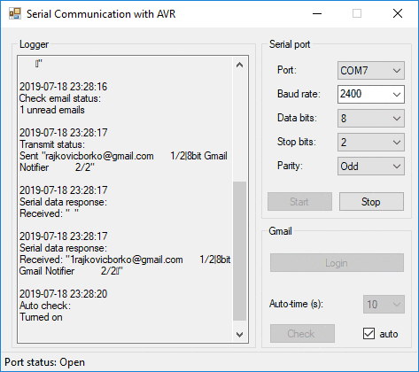
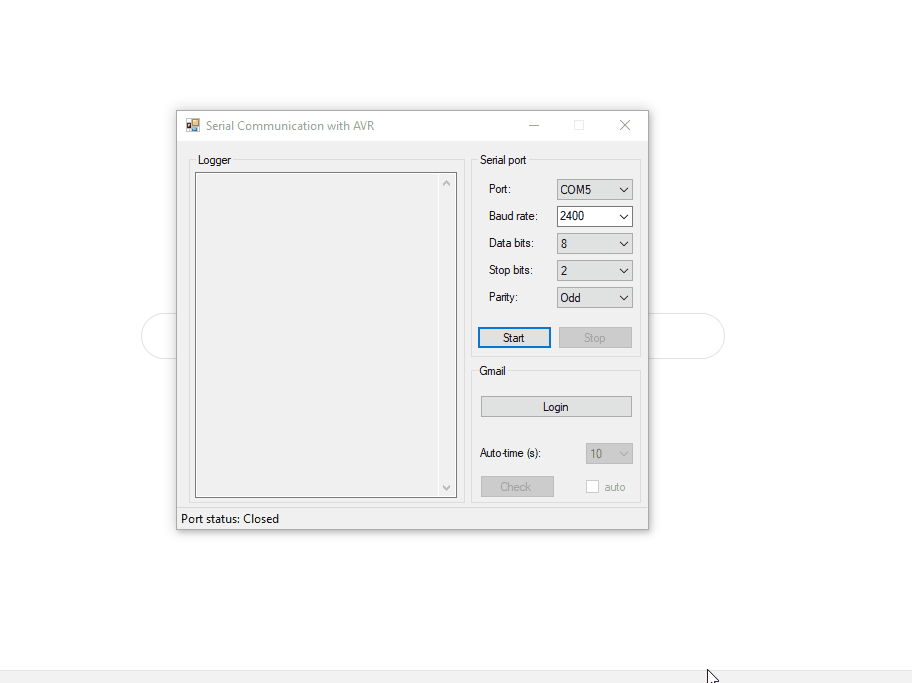
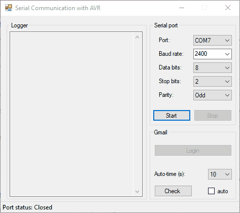

[![LinkedIn][linkedin-shield]][linkedin-url]

<!-- PROJECT LOGO -->
<br />
<p align="center">
  <a href="https://github.com/borko-rajkovic/8bit-gmail-notifier-csharp-uart">
    
  </a>

  <h3 align="center">8bit Gmail Notifier C# UART</h3>

  <p align="center">
    Windows application made for 
    <a align="center" href="https://github.com/borko-rajkovic/8bit-gmail-notifier">8bit Gmail Notifier</a> project
    <br />
    <a href="https://github.com/borko-rajkovic/8bit-gmail-notifier-csharp-uart/issues">Report Bug</a>
    ·
    <a href="https://github.com/borko-rajkovic/8bit-gmail-notifier-csharp-uart/issues">Request Feature</a>
  </p>
</p>

<!-- TABLE OF CONTENTS -->

## Table of Contents

- [About the Project](#about-the-project)
  - [Built With](#built-with)
- [Getting Started](#getting-started)
  - [Set up project](#set-up-project)
  - [Connecting to Gmail account](#connecting-to-gmail-account)
  - [Connect to device and send data](#connect-to-device-and-send-data)
- [Contributing](#contributing)
- [Contact](#contact)

<!-- ABOUT THE PROJECT -->

## About The Project

[![8bit-gmail-notifier-csharp-uart][product-screenshot]](https://github.com/borko-rajkovic/8bit-gmail-notifier-csharp-uart)

8bit Gmail Notifier C# UART is a small project made for [8bit-gmail-notifier](https://github.com/borko-rajkovic/8bit-gmail-notifier) project

It's built in C# and uses Google OAuth 2.0 to connect to Gmail account


### Built With

- .NET C#
- Google OAuth 2.0

<!-- GETTING STARTED -->

## Getting Started

### Set up project

To get a local copy of the project up and running, follow these simple steps:

1. Clone the repo

```sh
git clone https://github.com/borko-rajkovic/8bit-gmail-notifier-csharp-uart
```

2. Create new application on Google account and generate credentials for OAuth 2.0 authorization as explained [here](https://developers.google.com/identity/protocols/OAuth2InstalledApp#creatingcred)

3. Once you got your credentials, you should populate `clientID` and `clientSecret` in Main.cs accordingly

### Connecting to Gmail account

Once you run application after finishing steps above, you should be able to connect to your Gmail as shown here:



### Connect to device and send data

After successful connection to Gmail account, you can connect to device and send data as shown here:




<!-- CONTRIBUTING -->

## Contributing

Contributions are what make the open source community such an amazing place to learn, inspire, and create. Any contributions you make are **greatly appreciated**.

1. Fork the Project
2. Create your Feature Branch (`git checkout -b feature/AmazingFeature`)
3. Commit your Changes (`git commit -m 'Add some AmazingFeature`)
4. Push to the Branch (`git push origin feature/AmazingFeature`)
5. Open a Pull Request

<!-- CONTACT -->

## Contact

Borko Rajkovic - [LinkedIn](https://linkedin.com/in/borko-rajkovic) - rajkovicborko@gmail.com

<!-- MARKDOWN LINKS & IMAGES -->

[linkedin-shield]: https://img.shields.io/badge/-LinkedIn-black.svg?style=flat-square&logo=linkedin&colorB=555
[linkedin-url]: https://linkedin.com/in/borko-rajkovic/
[product-screenshot]: ./screenshot.gif
